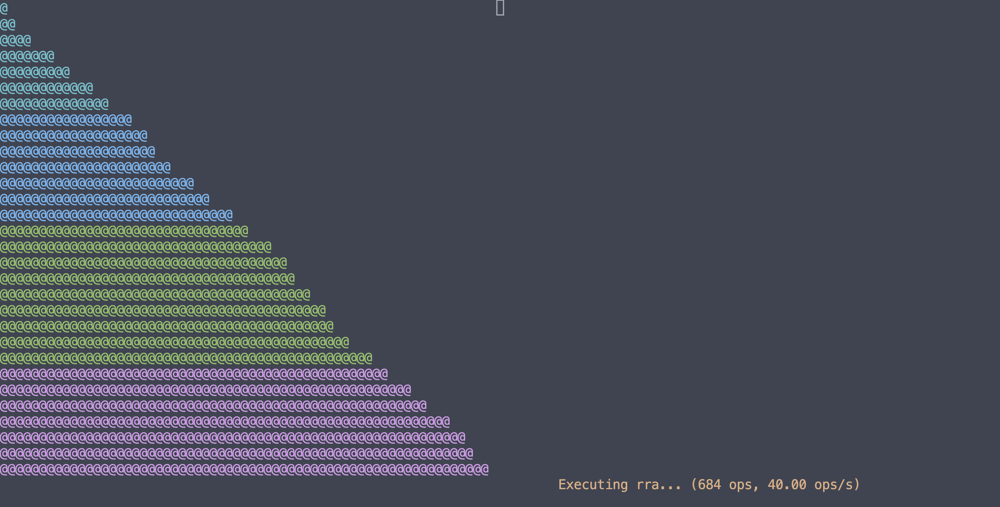

# pushswap


Welcome to **pushswap**, a program that sorts two stacks using circular doubly
linked lists and the radix sort algorithm. This project aims to provide a fast
and efficient way to sort a large number of integers.

- Bonus colorful visualizer made with ncurses
- Sorts two stacks efficiently using the radix sort algorithm
- Main code is written in C for optimal performance
- Uses circular doubly linked lists for efficient stack manipulation

# getting started

Clone the repo:

```sh
git clone git@github.com:Jabolol/pushswap.git .
```

Compile the program:

```sh
make
```

To run the program, use the following command:

```sh
./push_swap <list of integers>
```

This will output a list of operations that will sort the given list of integers.

# bonus

Go to the bonus directory:

```sh
cd bonus/
```

Compile the program:

```sh
make
```

To run the visualizer, use the following command:

```sh
./visualizer <number_count> <max_number> /path/to/push_swap
```

For example, running this will sort `30` random numbers from `0` to `30000`
using the binary in the `parent` directory:

```sh
./visualizer 30 30000 ../push_swap
```


